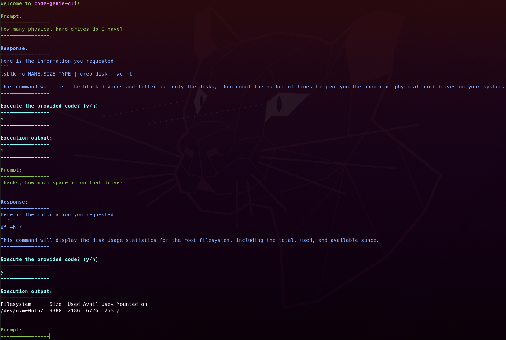

# code-genie-cli

Uses OpenAI's GPT API to get a helpful assistant within your terminal. Genie can suggest code executions that will be directly run after confirmation from the user. Forget the command to mount a drive? Simply ask code-genie-cli to do it for you!

## Installation

* Clone project to local machine

* Install python3 and python3-pip if not already installed

* Create file called chatgpt_key.txt in project directory, copy and paste your OpenAI key into this file. You get $18 free credit as a new user signing up to https://platform.openai.com/.

* `cd` into the project directory and run `pip3 install -e .`

* This will have installed dependencies and create a script named code-genie-cli in your python3 bin/

* You may need to add that bin/ to your $PATH, find the bin/ by running `python3 -m site --user-base`. Then add this to your ~/.bashrc `export PATH="/path/to/your/python/bin:$PATH"`

* Restart your shell
